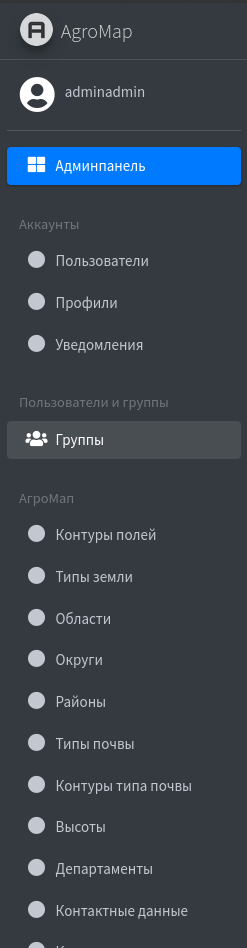
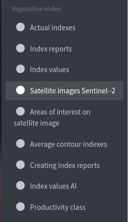

# Administrative Panel

Documentation for using the "AgroMap" administrative panel.

## What you need

+ [Windows/Linux/Mac] Computer usage experience
+ [Internet] Access to the network
+ [GIS] Knowledge of geographic markup basics (longitude/latitude)
+ [Kyrgyzstan] Understanding of geographic boundaries of regions, districts, and counties.

## Authorization

To use the administrative panel, you need to log in.

Enter the administrator's username and password. After that, you will be redirected to the main page.

## Main Page

You can also change the language or log out by clicking on the corresponding tabs in the upper right corner.

On the left side of the panel, there is navigation for objects and categories.

## Creating a Contour

To create a contour, you need to create objects such as "Region," "District," "County," and "Soil Type."

Note: You need to maintain the hierarchy of objects, meaning you need to specify a district to create a county and a region to create a district.

### Creating a Contour

Select the "Field Contours" object on the left side and click "Add Field Contours." You will be taken to the contour creation page.

Fill in the necessary data; required fields will be marked with a red asterisk *. The vegetation type will be automatically determined if the data about the type is available in the database.

#### Field Definitions

+ [SOATO Code] - System for Designating Objects of Administrative and Territorial Division of the Kyrgyz Republic.

+ [Productivity] - Crop productivity is measured in centners per hectare (c/ha), and values above 1.6 are considered good.

+ [Vegetation Type] - A list of plant species that grow in fields within this contour.

+ [Predicted Productivity] - Productivity is determined by artificial intelligence (AI) trained on initial data.

+ [is deleted] - The status of the object in the database in case of non-operation is marked with a checkmark.

+ [INC] - The identification number of the contour, assigned to it for unique identification and tracking in the database.

+ [YEI] - ?

+ [Legally Confirmed] - The legally confirmed status of the object in the database is also marked with a checkmark.

+ [Contour] - Important*: The contour should not extend beyond the territory of Kyrgyzstan.

#### Creating Field Types

To create a new field type, go to the object list and click "Add..." Fill in the required fields in the form.

#### Creating Soil Types

Usually, there is no need to create a new soil type, but if necessary, follow the steps from the previous sections. Click "Add..." and fill in the required data in the form.

#### Creating Land Type Contours

This object relates to soil types and is used to indicate contours of different soil types on the map.

#### Creating Crops

To create a new object, go to the object list and click "Add..." Fill in the required fields in the form.

#### Creating Productivity

To create a new object, go to the object list and click "Add..." Fill in the required fields in the form.

Productivity is closely related to Crop objects.

## Vegetation Index

The vegetation index is a numerical parameter used to assess the health and activity of vegetation on the Earth's surface. It is based on measurements of light characteristics obtained from satellite images or sensors. Vegetation indices help scientists and agronomists track plant growth, assess productivity, and identify signs of stress in vegetation.

### Creating Actual Vegetation Index

Usually, there is no need to create an Actual Vegetation Index, but if necessary, follow the steps from the previous sections. Click "Add..." and fill in the required data in the form.

##### In case of errors during operation, all messages will be recorded in the "Index Report."

### Index Value

This parameter determines the average value of the index within the specified range.

Also, there is usually no need to create a new object, but if necessary, follow the steps from the previous sections. Click "Add..." and fill in the required data in the form.

## Sentinel-2 Satellite Images

Sentinel-2 satellite images are an important tool for various applications in agriculture. Sentinel-2 satellite images allow agronomists and farmers to monitor crop conditions, assess productivity, control diseases and pests, and optimize the use of resources such as water and fertilizers.

### Creating Satellite Image Objects

To create a new object, go to the object list and click "Add..." Fill in the required fields in the form.

"Layer or layers" refers to an image layer from a collection of images downloaded from https://dataspace.copernicus.eu/.

### Satellite Image Regions of Interest

Regions of interest are used for filtering satellite images and their further processing using your own service. Additionally, this object is closely related to the "Satellite Image" object.

### Creating Productivity Classes

To create a new object, go to the object list and click "Add...". Fill in the required fields in the form.

### Creating Index Reports

To create a new object, go to the object list and click "Add...". Fill in the required fields in the form.

### Creating Average Contour Indices

To create a new object, go to the object list and click "Add...". Fill in the required fields in the form.

## AI - Artificial Intelligence

An artificial intelligence system created to monitor agricultural information from satellite imagery uses computer vision and machine learning algorithms to analyze data. It automatically recognizes agricultural plots and assesses the condition of crops. This artificial intelligence contributes to improving agricultural efficiency and promoting sustainable development in rural areas.

### Dataset Creation

To create a new object, go to the list of objects and click "Add...". Fill in the required fields in the form. It is important to note that the dataset is in a compressed state (archive).

##### Additional Information

Create objects located in the "AI" category. The name corresponds to the functionality.

