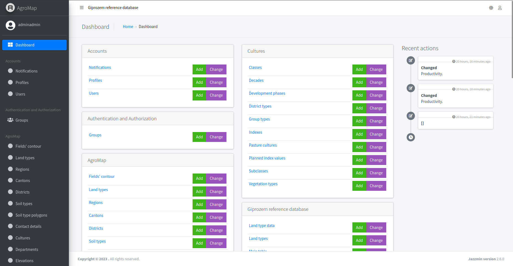
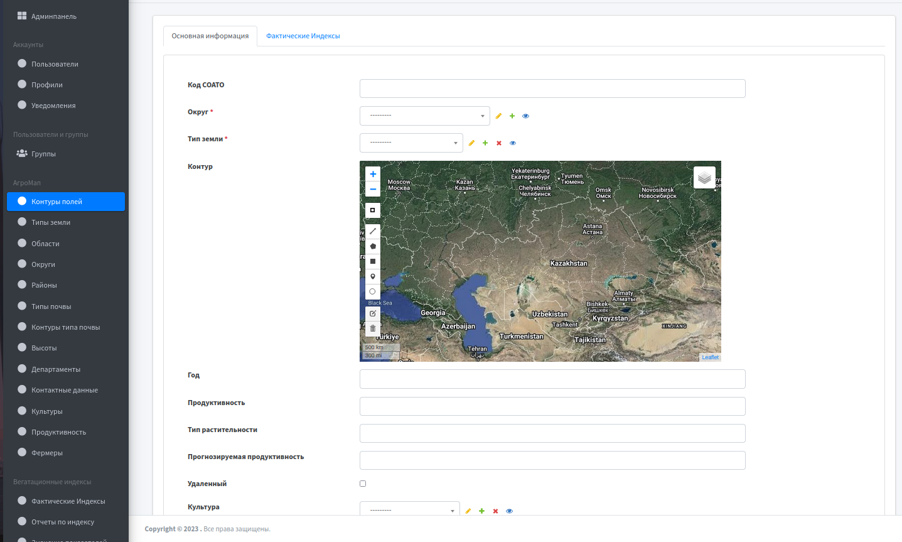

# Административная панель.

Документация по использованию административной панели "AgroMap".

## Что нужно

+ [Windows/Linux/Mac] Опыт использования компьютера
+ [Интернет] Доступ к сети
+ [ГИС] Знание основ географической разметки (долгота/широта)
+ [Кыргызстан] Понимание географических границ областей, регионов и округов.

## Авторизация

Для использования административной панели вам необходимо авторизоваться.

Введите логин и пароль администратора. После этого вы будете перенаправлены на главную страницу.

## Главная страница

Вы также можете изменить язык или выйти из системы, перейдя по соответствующим вкладкам в правом верхнем углу.

В левой части панели находится навигация по объектам и категориям.

## Создание контура

Для создания контура необходимо создать объекты "Регион", "Область", "Округ" и "Тип почвы".

Примечание: Необходимо соблюдать иерархию объектов, то есть для создания округа необходимо указать область, а для области - регион.

### Создание контура

Выберите объект "Контуры полей" в левой части и нажмите "Добавить контуры полей". Вас перенесет на страницу создания контура.

Заполните необходимые данные, обязательные поля будут отмечены красной звездочкой *. Тип растительности будет определен автоматически, если данные о типе есть в базе данных.

#### Определение полей

+ [Код СОАТО] - Система обозначения объектов административно - территориального деления Кыргызской Республики.
+ [Продуктивность] - Продуктивность урожайности измеряется в центнерах на гектар (ц/га), и значения выше 1.6 считаются хорошими.
+ [Тип растительности] - Список видов растений, которые растут на полях в данном контуре.
+ [Прогнозируемая продуктивность] - Продуктивность определяется искусственным интеллектом (ИИ), обученным на основе изначальных данных. 
+ [Удаленный] - Статус объекта в базе данных в случае неэксплуатации обозначается галочкой.
+ [ИНК] - Индентификационный номер контура, который присваивается контуру для его уникальной идентификации и отслеживания в базе данных.
+ [ЕНИ] - ?
+ [Юридически подтвержденный] - Юридически подтвержденный статус объекта в базе данных также обозначается галочкой.

+ [Контур] - Важно*: Контур не должен выходить за пределы территории Кыргызстана.

#### Создание Типов полей

Для создания нового типа поля перейдите к списку объектов и нажмите "Добавить...". Заполните необходимые поля в форме.

#### Создание Типов почв

Обычно нет необходимости создавать новый тип почвы, но если это требуется, следуйте шагам из предыдущих разделов. Нажмите "Добавить..." и заполните необходимые данные в форме.

#### Создание Контуры типов почв

Этот объект относится к типам почвы и используется для указания контуров различных типов почв на карте.

#### Создание Культур

Для создания нового типа поля перейдите к списку объектов и нажмите "Добавить...". Заполните необходимые поля в форме.

#### Создание Продуктивность

Для создания нового типа поля перейдите к списку объектов и нажмите "Добавить...". Заполните необходимые поля в форме.

Продуктивность тестно связана с обьектами Культур.